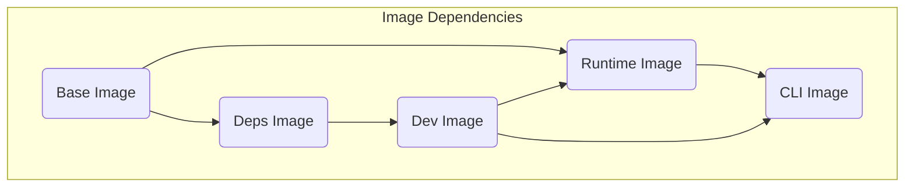
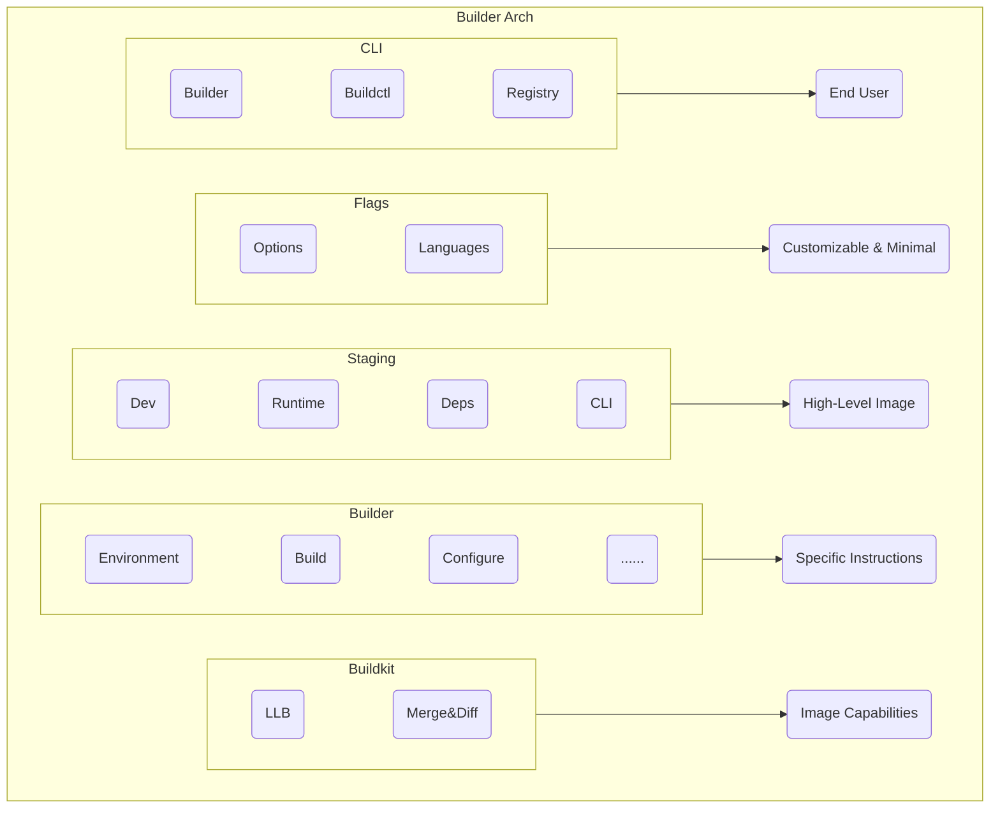

## Arch

The document describes the architecture of the project.

### Image Dependencies

According to the [Dockerfiles](https://github.com/metacall/core/tree/develop/tools) in core,
we infer the dependencies and inheritance relationships between different versions of images.

This determines the dependencies and stages of Builder subcommands.

### Builder Arch

According to the [Dockerfiles](https://github.com/metacall/core/tree/develop/tools)
and [Shell Scripts](https://github.com/metacall/core/tree/develop/tools) in core,
Builder is designed as a multi-layer architecture, with each layer providing capabilities to the upper layers
and enables the Builder to flexibly merge and diff image layers.

